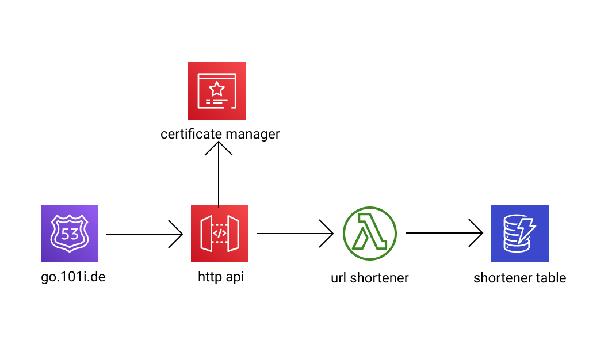

# url-shortener
[](https://github.com/michaelbrewer/url-shortener/actions/workflows/lambda.python.yml)
[](https://github.com/michaelbrewer/url-shortener/actions/workflows/cdk.java.yml)
[](https://codecov.io/gh/michaelbrewer/url-shortener)
[](https://github.com/psf/black)
[](https://ktlint.github.io/)
[](https://conventionalcommits.org)

URL Shortener AWS CDK example.

# High level infrastructure architecture

- [Route 53](https://aws.amazon.com/route53/) - Is used to setup the dns records for the url shortener public endpoint
- [API Gateway Http Api](https://docs.aws.amazon.com/apigateway/latest/developerguide/http-api.html) - Is used to host shortener calls
- [AWS Certificate Manager](https://aws.amazon.com/certificate-manager/) - Is used to manage the wild card SSL cert
- [AWS Lambda](https://aws.amazon.com/lambda/) - A Python 3.8 AWS Lambda function is used for both the creation of the shortened url but also the redirects
- [AWS DynamoDB](https://aws.amazon.com/dynamodb/) - Used as the NoSQL database to store the shortened urls





# Building the Python Lambda

> NOTE: Python 3.8+ is required

To install the required dev dependencies and run the unit tests. Run the following commands.

```shell
# Install the dev dependencies
make dev
# Build and run the unit tests
make pr
```

See [IAC ReadMe](iac/README.md) for more details on how to deploy via AWS CDK

# Tools used in this project

## Design patterns and conventions

- [Conventional Commits](https://www.conventionalcommits.org/en/v1.0.0/) - A specification for adding human and machine readable meaning to commit messages
- [The Twelve-Factor App](https://12factor.net/) - The Twelve-Factor App methodology is a methodology for building software-as-a-service applications. These best practices are designed to enable applications to be built with portability and resilience when deployed to the web.
- [Serverless Application Lens](https://docs.aws.amazon.com/wellarchitected/latest/serverless-applications-lens/welcome.html) - Covers common serverless applications scenarios and identifies key elements to ensure that your workloads are architected according to best practices
- [DORA research program](https://www.devops-research.com/research.html) - DORA's State of DevOps research program represents six years of research and data from over 31,000 professionals worldwide

### GitHub actions
- [CodeQL](https://securitylab.github.com/tools/codeql/) - Discover vulnerabilities across a codebase with CodeQL
- [Dependabot](https://docs.github.com/en/code-security/supply-chain-security/managing-vulnerabilities-in-your-projects-dependencies/configuring-dependabot-security-updates) - Dependabot security updates
- [Python build](https://docs.github.com/en/actions/guides/building-and-testing-python) - Building and testing Python
- [Kotlin build](https://docs.github.com/en/actions/guides/building-and-testing-java-with-gradle) - Build and testing Kotlin
- [CodeCoverage](https://about.codecov.io) - Code coverage reporting

### Python AWS Lambda tools
- [PipEnv](https://pipenv.pypa.io/en/latest/) - Python dependency management and manages virtualenv
- [Flake8](https://flake8.pycqa.org/en/latest/) - Python code style linting
- [Black](https://github.com/psf/black) - The uncompromising Python code formatter
- [iSort](https://pycqa.github.io/isort/) - Python utility to sort imports alphabetically, and automatically separated into sections and by type
- [PyTest](https://docs.pytest.org/en/6.2.x/index.html) - Testing framework for Python
- [Moto](https://github.com/spulec/moto) - A library that allows you to easily mock out tests based on AWS infrastructure.
- [Lambda Powertools](https://github.com/awslabs/aws-lambda-powertools-python) - A suite of utilities for AWS Lambda Functions that makes tracing with AWS X-Ray, structured logging and creating custom metrics asynchronously easier
- [PreCommit](https://pre-commit.com) - A framework for managing and maintaining multi-language pre-commit hooks.
- [Radon](https://github.com/rubik/radon/) & [Xenon](https://github.com/rubik/xenon) - Various code metrics for Python code

### Infrastructure code tools
- [Gradle Versions Plugin](https://github.com/ben-manes/gradle-versions-plugin) - plugin provides a task to determine which dependencies have updates
- [AWS CDK](https://aws.amazon.com/cdk/) - Define cloud infrastructure using familiar programming languages
- [Junit 5](https://junit.org/junit5/docs/current/user-guide/) - JUnit 5
- [JaCoCo](https://www.eclemma.org/jacoco/) - JaCoCo Java Code Coverage Library
- [KtLint](https://github.com/pinterest/ktlint) - An anti-bikeshedding Kotlin linter with built-in formatter
- [Detekt](https://github.com/detekt/detekt) - A static code analysis tool for the Kotlin programming language
- [CFNLint](https://github.com/aws-cloudformation/cfn-lint) - Validate AWS CloudFormation yaml/json templates against the AWS CloudFormation Resource Specification
- [Serverless Rules](https://github.com/awslabs/serverless-rules/) - The Serverless Rules are a compilation of rules to validate infrastructure as code template against recommended practices
- [CFN-Diagram](https://github.com/mhlabs/cfn-diagram) - CLI tool to visualise CloudFormation/SAM/CDK templates as diagrams
- [CDK Watchful](https://github.com/cdklabs/cdk-watchful) - Construct library that makes it easy to monitor CDK apps
